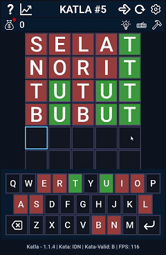
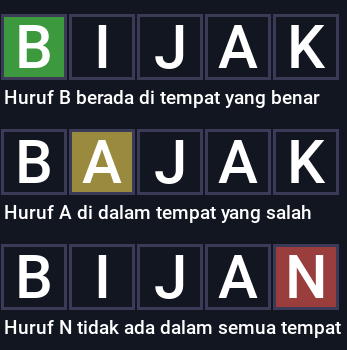

# Katla - pygame - Python 3
Lisensi Hak cipta ~ Copyright © 2024 - 2026 [ Azzamuhyala ]

Izin dengan ini diberikan, tanpa dipungut biaya, kepada siapa pun yang memperoleh salinannya
perangkat lunak ini dan file dokumentasi terkait "Perangkat Lunak", untuk ditangani
dalam Perangkat Lunak tanpa batasan, termasuk tanpa batasan hak
untuk menggunakan, menyalin, memodifikasi, menggabungkan, menerbitkan, mendistribusikan, mensublisensikan, dan/atau menjual
salinan Perangkat Lunak, dan untuk mengizinkan orang yang memiliki Perangkat Lunak tersebut
diperlengkapi untuk melakukannya, dengan syarat-syarat berikut:

Pemberitahuan hak cipta di atas dan pemberitahuan izin ini harus disertakan dalam keseluruhannya
salinan atau sebagian besar Perangkat Lunak.

PERANGKAT LUNAK INI DISEDIAKAN "APA ADANYA", TANPA JAMINAN APA PUN, SECARA TERSURAT MAUPUN
TERSIRAT, TERMASUK NAMUN TIDAK TERBATAS PADA JAMINAN KELAYAKAN UNTUK DIPERDAGANGKAN,
KESESUAIAN UNTUK TUJUAN TERTENTU DAN TIDAK PELANGGARAN. DALAM KEADAAN APA PUN
PENULIS ATAU PEMEGANG HAK CIPTA BERTANGGUNG JAWAB ATAS KLAIM, KERUSAKAN ATAU LAINNYA
TANGGUNG JAWAB, BAIK DALAM TINDAKAN KONTRAK, HUKUM ATAU LAINNYA, YANG TIMBUL DARI,
DILUAR ATAU SEHUBUNGAN DENGAN PERANGKAT LUNAK ATAU PENGGUNAAN ATAU HAL-HAL LAIN DALAM
PERANGKAT LUNAK.

*_Tampilan permainan di versi saat ini_.

Cara bermain?
---
> Jika Kamu ingin menjalankan permainan ini dengan Python install modul yang diperlukan di file "`docs/requirements.txt`" (Hiraukan komentar #) atau jalankan perintah berikut: `pip install -r docs/requirements.txt`. Jika Kamu menggunakan Windows, pergi ke link Google Drive yang disediakan lalu Kamu download, buka folder Katla lalu Kamu cukup ekstrak file `Katla.zip` kemudian buka folder `Katla` dan jalankan aplikasi `Katla.exe`.

Dalam permainan ini, Kamu harus menebak kata yang dipilih secara acak dari kamus yang ada. Sebagai petunjuk akan di berikan 3 warna yang menandakan seberapa dekat Kamu dengan kata tersebut.

Sebagai Contoh:

_**Daftar warna dan maksudnya**_:
- *HIJAU*: Berada di tempat yang benar.
- *KUNING*: Ada dalam kata yang dipilih akan tetapi tempatnya salah.
- *MERAH*: Tidak ada dalam semua tempat.

Tiap Kamu menang, Kamu mendapatkan **1 koin**. Dapatkan koin harian selama 24 jam untuk mendapatkan **50 koin**. Koin berfungsi untuk membeli 3 bantuan yakni `PETUNJUK HURUF`, `PETUNJUK PAPAN KEYBOARD`, dan `PENGHAPUS KATA PADA PAPAN KETIK`. Tiap bantuan memiliki fungsinya tersendiri sesuai dengan namanya.

_**Daftar tombol pintas dan maksudnya**_:
- Tombol `Esc` _Escape_: Menutup tampilan popup / pengaturan.
- Tombol `Tab`: Mengecilkan layar aplikasi ke ukuran minimal.
- Tombol `F11`: Mempebesar layar aplikasi ke ukuran penuh.
- Tombol `ATAS`, dan `BAWAH`: Menggulir tampilan papan ketik / pengaturan.
- Tombol `1`: Membuka tampilan popup `CARA MAIN`.
- Tombol `2`: Membuka tampilan popup `STATISTIK`.
- Tombol `3`: Menulis kata yang benar / kata dari bantuan secara otomatis.
- Tombol `4`: Permainan diulang.
- Tombol `5`: Membuka tampilan `PENGATURAN`.
- Tombol `7`: Membuka tampilan popup `KOIN HARIAN`.
- Tombol `8`: Membuka tampilan popup `PETUNJUK HURUF`.
- Tombol `9`: Membuka tampilan popup `PETUNJUK PAPAN KEYBOARD`.
- Tombol `0`: Membuka tampilan popup `MENGHAPUS KATA PADA PAPAN KETIK`.

_**Daftar petunjuk / bantuan dan maksudnya**_:

**`PETUNJUK HURUF`**: Petunjuk huruf akan ditampilkan di papan ketik dari huruf awal hingga seterusnya.

_Kelebihan dari petunjuk ini_:
- Memberikan bonus petunjuk keyboard.
- Huruf akan secara langsung ditampilkan di papan ketik
- Huruf dari bantuan, masuk dari tombol pintas ketik otomatis.

_Kekurangan dari petunjuk ini_:
- Tidak dapat meneruskan petunjuk huruf setelahnya dari `PETUNJUK PAPAN KEYBOARD`.
- Harga lebih mahal

**`PETUNJUK PAPAN KEYBOARD`**: Memberikan petunjuk pada papan keyboard. Ini hanya akan memberi petunjuk huruf yang berbeda, bukan huruf ganda atau lebih.

_Kelebihan dari petunjuk ini_:
- Dapat meneruskan petunjuk pada `PETUNJUK HURUF`.
- Harga lebih murah.

_Kekurangan dari petunjuk ini_:
- Petunjuk yang diberikan hanya dari huruf yang berbeda, bukan huruf yang ganda atau lebih.
- Huruf dari bantuan, tidak masuk dari tombol pintas ketik otomatis.

**`PENGHAPUS KATA PADA PAPAN KETIK`**: Mengahapus salah satu kata dalam papan ketik.

_Kelebihan petunjuk ini_:
- Jauh lebih murah.
- Dapat memberikan kesempatan 1 kata tambahan.

_Kekurangan petunjuk ini_:
- Tidak memberikan petunjuk huruf sama sekali.

Fitur / Peningkatan
---
* Perbaikan kode
* Perbaikan front-end
* Perbaikan resize layar
* Perbaikan pengaturan
* Perbaikan dokumentasi
* Fitur administrator
* Fitur layar penuh
* Penambahan aplikasi baru (Katla solver)
* Kata baru di tambahkan (Akan berusaha di perbarui)

Daftar versi
---
* `1.0.0 (Snapshot)`: Selasa, 21/05/2024 - 21:40:24
* `1.0.0 (Release)`: Kamis, 23/05/2024 - 21:18:00
* `1.1.0`: Jumat, 31/05/2024 - 16:30:00
* `1.1.1`: Minggu, 02/06/2024 - 11:42:21
* `1.1.2`: Minggu, 09/06/2024 - 14:21:53
* `1.1.3`: Rabu, 12/06/2024 - 13:44:42
* `1.1.4`: Selasa, 18/06/2024 - 18:06:24 (baru)

Daftar aplikasi permainan saya
---
_Google Drive: https://drive.google.com/drive/folders/1WSkXju5i4SUJocQLp1yyA0ELSaff6wpo?usp=sharing_

_Github: Katla: https://github.com/azzammuhyala/Katla.git_

* `Snake`
* `Minesweeper`
* `Numpuz`
* `Katla` (Permainan ini)
* dll

Refrensi
---
- https://play.google.com/store/apps/details?id=com.san.katla
- https://www.nytimes.com/games/wordle/index.html
- https://katla.id

Kamus
---
- https://kbbi.kemdikbud.go.id
- https://github.com
- https://kbbi.co.id
- https://katla.id

Tanggal dirilis
---
**Selasa, 18/06/2024 - 18:06:24**

"_Terima kasih sudah membaca / memainkan permainan yang saya buat :)_"

