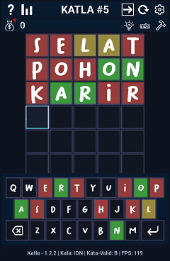
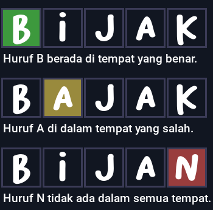

# Katla - pygame - Python 3
Lisensi Hak cipta ~ Copyright © 2024 - 2026 [ Azzamuhyala ] ~ LICENSE MIT (Selengkapnya ada di file `LICENSE`)

*_Tampilan permainan di versi saat ini_.

Cara bermain?
---
> Jika Kamu ingin menjalankan permainan ini dengan Python install modul yang diperlukan di file "`docs/requirements.txt`" (Hiraukan komentar tagar **#**) atau jalankan perintah berikut: `pip install -r docs/requirements.txt`. Jika Kamu menggunakan Windows, Silahkan buka link Google Drive lalu buka folder Katla dan kemudian Kamu pilih Katla.zip lalu klik ikon atau opsi unduh lalu Kamu cukup ekstrak file `win.katla.onefile.zip` kemudian buka folder `Katla` dan jalankan aplikasi `Katla.exe`. Jika Kamu tidak menemukan file zip yang di maksud di Google Drive kemungkinan besar Google membatasinya karena masalah kecurigaan aplikasi yang dianggap berbahaya. **APLIKASI EXE INI SAMA DENGAN SOURCE KODE PYTHON**.

Dalam permainan ini, Kamu harus menebak kata yang dipilih secara acak dari kamus yang ada. Sebagai petunjuk akan di berikan 3 warna yang menandakan seberapa dekat Kamu dengan kata tersebut.

Sebagai Contoh:

_**Daftar warna dan maksudnya**_:
- *HIJAU*: Berada di tempat yang benar.
- *KUNING*: Ada dalam kata yang dipilih akan tetapi tempatnya salah.
- *MERAH*: Tidak ada dalam semua tempat.

Tiap Kamu menang, Kamu mendapatkan **1 koin** (_Bonus 1 koin tambahan di panjang kata 9 huruf_). Dapatkan koin harian selama 24 jam untuk mendapatkan **50 koin**. Koin berfungsi untuk membeli 3 bantuan yakni `PETUNJUK HURUF`, `PETUNJUK PAPAN KEYBOARD`, dan `PENGHAPUS KATA PADA PAPAN KETIK`. Tiap bantuan memiliki fungsinya tersendiri sesuai dengan namanya.

_**Daftar tombol pintas dan maksudnya**_:
- Tombol `Esc` _Escape_: Menutup tampilan popup / pengaturan.
- Tombol `Tab`: Mengecilkan layar aplikasi ke ukuran minimal.
- Tombol `F11`: Mempebesar layar aplikasi ke ukuran penuh.
- Tombol `ATAS`, dan `BAWAH`: Menggulir tampilan papan ketik / pengaturan.
- Tombol `1`: Membuka tampilan popup `CARA MAIN`.
- Tombol `2`: Membuka tampilan popup `STATISTIK`.
- Tombol `3`: Menulis kata yang benar / kata dari bantuan secara otomatis.
- Tombol `4`: Permainan diulang.
- Tombol `5`: Membuka tampilan `PENGATURAN`.
- Tombol `6`: Membuka tampilan `CATATAN`.
- Tombol `7`: Membuka tampilan popup `KOIN HARIAN`.
- Tombol `8`: Membuka tampilan popup `PETUNJUK HURUF`.
- Tombol `9`: Membuka tampilan popup `PETUNJUK PAPAN KEYBOARD`.
- Tombol `0`: Membuka tampilan popup `MENGHAPUS KATA PADA PAPAN KETIK`.

_**Daftar petunjuk / bantuan dan maksudnya**_:

**`PETUNJUK HURUF`**: Petunjuk huruf akan ditampilkan di papan ketik dari huruf awal hingga seterusnya.

_Kelebihan dari petunjuk ini_:
- Memberikan bonus petunjuk keyboard.
- Huruf akan secara langsung ditampilkan di papan ketik
- Huruf dari bantuan, masuk dari tombol pintas ketik otomatis.

_Kekurangan dari petunjuk ini_:
- Tidak dapat meneruskan petunjuk huruf setelahnya dari `PETUNJUK PAPAN KEYBOARD`.
- Harga lebih mahal

**`PETUNJUK PAPAN KEYBOARD`**: Memberikan petunjuk pada papan keyboard. Ini hanya akan memberi petunjuk huruf yang berbeda, bukan huruf ganda atau lebih.

_Kelebihan dari petunjuk ini_:
- Dapat meneruskan petunjuk pada `PETUNJUK HURUF`.
- Harga lebih murah.

_Kekurangan dari petunjuk ini_:
- Petunjuk yang diberikan hanya dari huruf yang berbeda, bukan huruf yang ganda atau lebih.
- Huruf dari bantuan, tidak masuk dari tombol pintas ketik otomatis.

**`PENGHAPUS KATA PADA PAPAN KETIK`**: Mengahapus salah satu kata dalam papan ketik.

_Kelebihan petunjuk ini_:
- Jauh lebih murah.
- Dapat memberikan kesempatan 1 kata tambahan.

_Kekurangan petunjuk ini_:
- Tidak memberikan petunjuk huruf sama sekali.

Fitur / Peningkatan
---
1. Perbaikan kata
2. Perbaikan kode
3. Perbaikan bahasa
4. Perbaikan performa
5. Perbaikan front-end
6. Perbaikan data katla
7. Perbaikan load screen
8. Perbaikan pengaturan
9. Perbaikan dokumentasi
10. Perbaikan popup statistik
11. Perubahan ikon
12. Perubahan kode
13. Perubahan format angka
14. Perubahan tombol pintas
15. Perubahan FPS, sekarang FPS maksimal adalah 140
16. Perubahan ukuran geometri, sekarang geometri minimal adalah 0,5x
17. Penambahan tema baru
18. Penambahan pengaturan baru
19. Penambahan tampilan baru "**Catatan / Logs**"
20. Menang beruntun sekarang dihitung perhari
21. Harga petunjuk berubah di panjang kata 8 dan 9 huruf
22. Maksimal kesempatan menebak jika kata bebas adalah 7
23. Bonus 1 koin tambahan saat menang di panjang kata 9 huruf
24. Maksimal kesempatan berubah saat tidak menggunakan kata valid

Daftar versi
---
* `1.0.0 (Snapshot)`: Selasa, 21/05/2024 - 21:40:24
* `1.0.0 (Release)`: Kamis, 23/05/2024 - 21:18:00
* `1.1.0`: Jumat, 31/05/2024 - 16:30:00
* `1.1.1`: Minggu, 02/06/2024 - 11:42:21
* `1.1.2`: Minggu, 09/06/2024 - 14:21:53
* `1.1.3`: Rabu, 12/06/2024 - 13:44:42
* `1.1.4`: Selasa, 18/06/2024 - 18:06:24
* `1.1.5 (BETA)`: Minggu, 23/06/2024 - 21:40:24
* `1.2.0`: Minggu, 14/07/2024 12:44:59 (baru)

Daftar aplikasi permainan saya
---
_Google Drive: https://drive.google.com/drive/folders/1WSkXju5i4SUJocQLp1yyA0ELSaff6wpo?usp=sharing_

_Github: Katla: https://github.com/azzammuhyala/Katla.git_

* `Snake`
* `Minesweeper`
* `Numpuz`
* `Katla` (Permainan ini)
* dll

Refrensi
---
- https://play.google.com/store/apps/details?id=com.san.katla
- https://www.nytimes.com/games/wordle/index.html
- https://katla.id

Kamus
---
- https://kbbi.kemdikbud.go.id
- https://github.com
- https://kbbi.co.id
- https://katla.id

Tanggal dirilis
---
**Minggu, 14/07/2024 12:44:59**

"_Terima kasih sudah membaca / memainkan permainan yang saya buat :)_"

